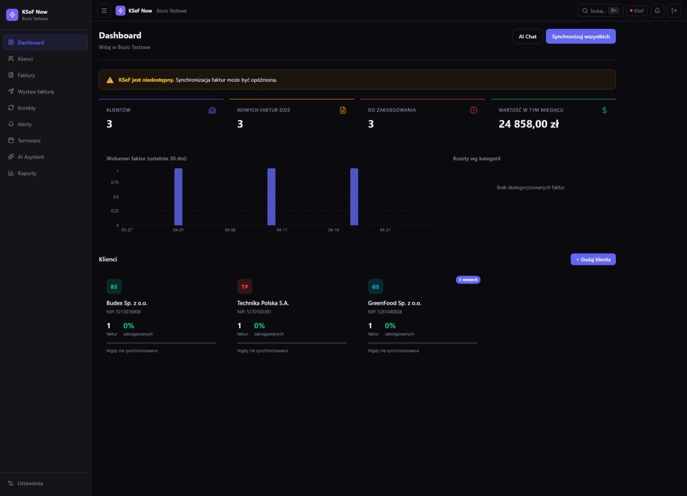

# KSeF Now

> AI assistant for accounting firms to handle Poland's National e-Invoice System (KSeF).



## What is it

KSeF Now is a SaaS platform for accounting firms and bookkeepers that automates the handling of mandatory KSeF (required from 2026). The application uses AI to analyze invoices, detect anomalies, validate documents before sending to the Ministry of Finance system, and synchronizes data bidirectionally with the National e-Invoice System API.

Built for accounting firms managing multiple clients who want to minimize manual invoice verification and avoid penalties for incorrect submissions.

## Features

- **AI categorization** — automatic recognition of cost type, VAT rate, and accounting code
- **KSeF Sync** — bidirectional synchronization with the Ministry of Finance API, queues, retries, event log
- **Anomaly alerts** — duplicate detection, unusual amounts, contractors outside the whitelist
- **KSeF Sandbox** — testing integration in the MF sandbox environment without production impact
- **Analytics dashboard** — Recharts charts, invoice history, submission statuses
- **Multi-access for firms** — manage multiple clients from a single panel (Supabase RLS)
- **Stripe billing** — SaaS subscriptions with 7-day trial, webhooks
- **DPA compliance** — ready-to-use data processing agreement template (GDPR)
- **Playwright scraping** — automated invoice retrieval from external systems

## Stack

| Layer | Technology |
|-------|-----------|
| Frontend | Next.js 16, React 19, TypeScript, Tailwind CSS v4 |
| Backend | Next.js API Routes, Zod validation |
| AI | OpenRouter API (claude-sonnet) |
| Database | Supabase (PostgreSQL + Auth + RLS) |
| Payments | Stripe (subscriptions, webhooks) |
| Email | Nodemailer |
| Charts | Recharts |
| Animations | Framer Motion |
| Deploy | Vercel |

## Getting Started

```bash
git clone https://github.com/emilpinski/ksefnow
cd ksefnow
npm install
cp .env.example .env.local
# Fill in environment variables
npm run dev
```

## Environment Variables

| Variable | Description | Required |
|----------|-------------|----------|
| `NEXT_PUBLIC_SUPABASE_URL` | Supabase project URL | ✅ |
| `NEXT_PUBLIC_SUPABASE_ANON_KEY` | Supabase public key | ✅ |
| `SUPABASE_SERVICE_ROLE_KEY` | Supabase service key (backend) | ✅ |
| `OPENROUTER_API_KEY` | OpenRouter API key | ✅ |
| `STRIPE_SECRET_KEY` | Stripe key (backend) | ✅ |
| `NEXT_PUBLIC_STRIPE_PUBLISHABLE_KEY` | Stripe key (frontend) | ✅ |
| `STRIPE_WEBHOOK_SECRET` | Webhook verification secret | ✅ |
| `SMTP_HOST` | SMTP server for emails | ✅ |
| `SMTP_USER` | SMTP login | ✅ |
| `SMTP_PASS` | SMTP password | ✅ |
| `KSEF_SANDBOX_URL` | MF sandbox API URL | ✅ |

## Status

WIP — staging, production deployment 2026

---
Built by [Emil Piński](https://emilpinski.pl)
