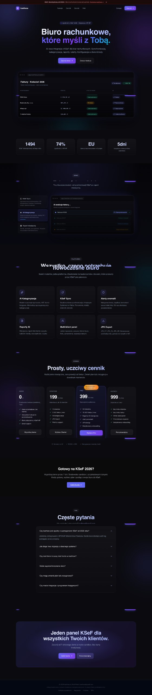
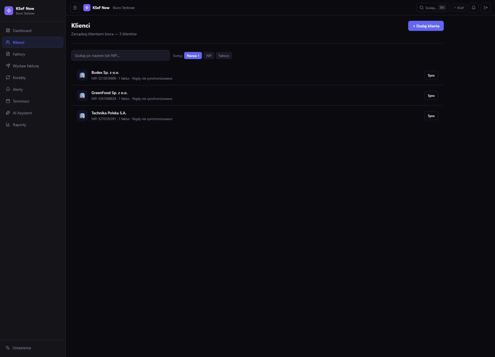
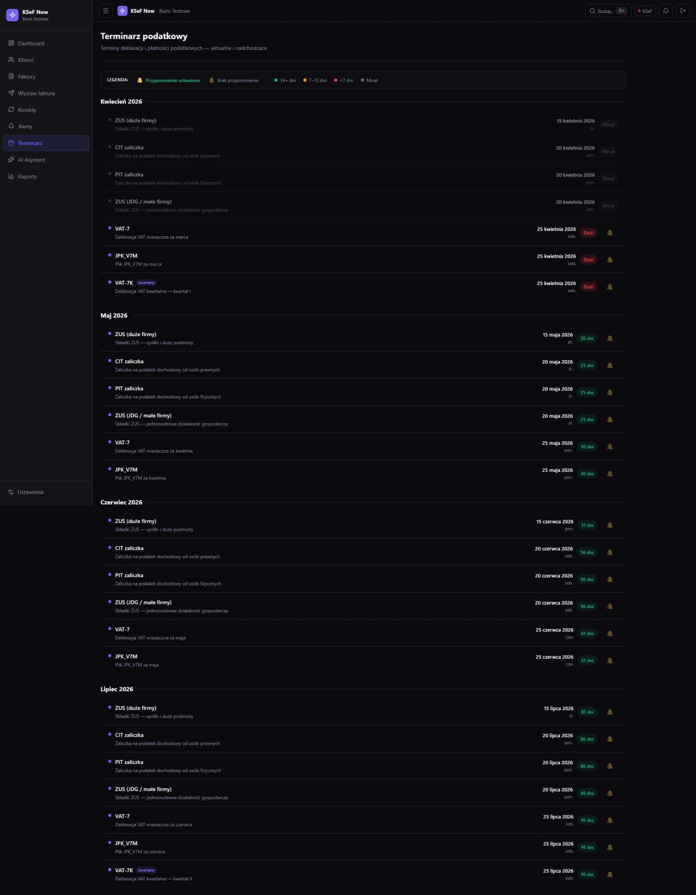
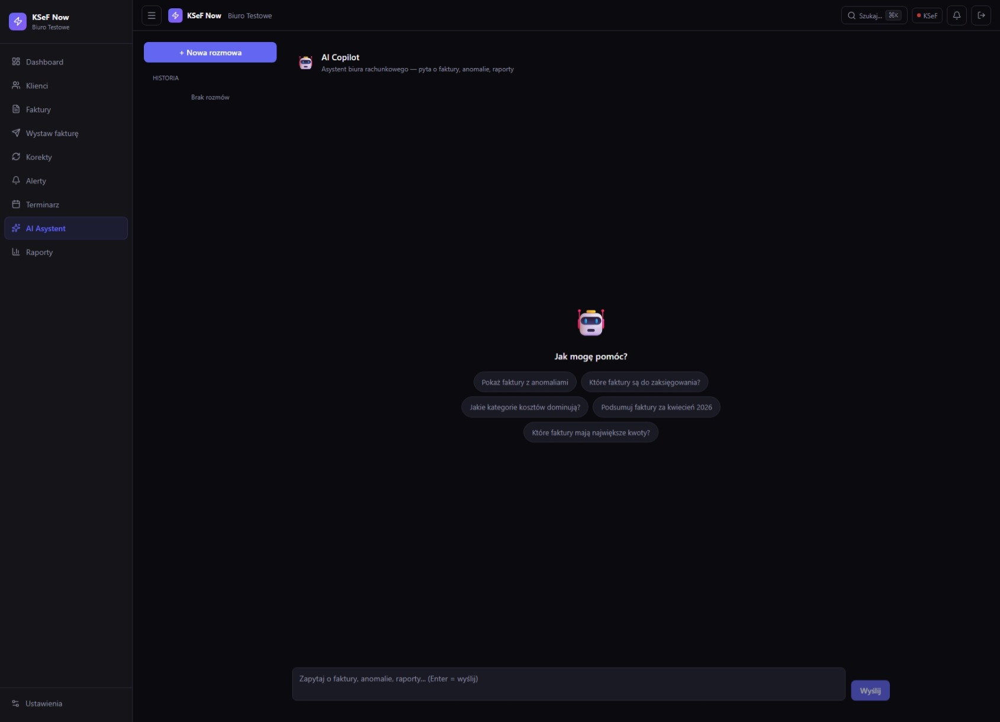
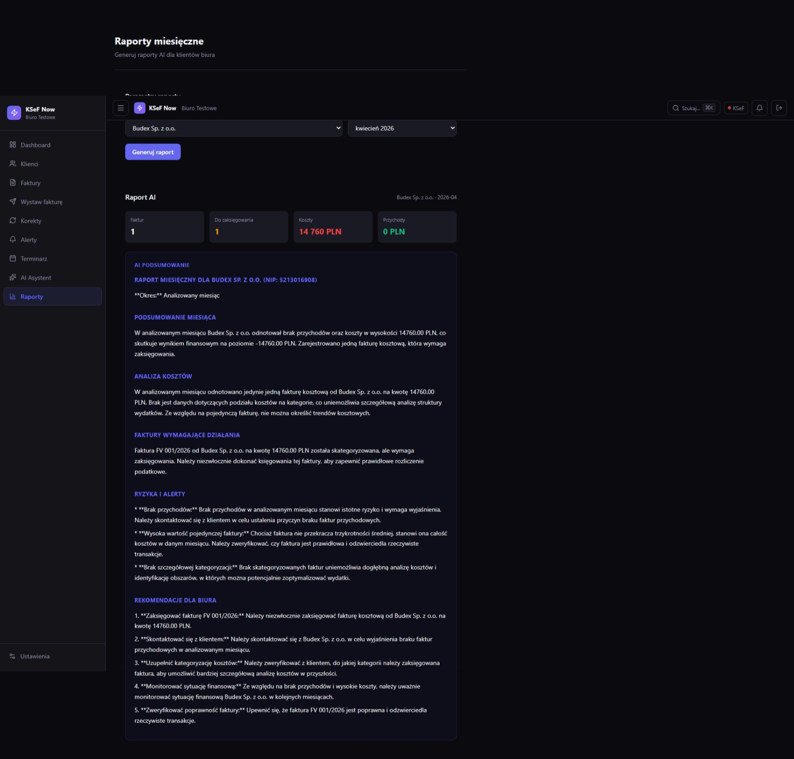
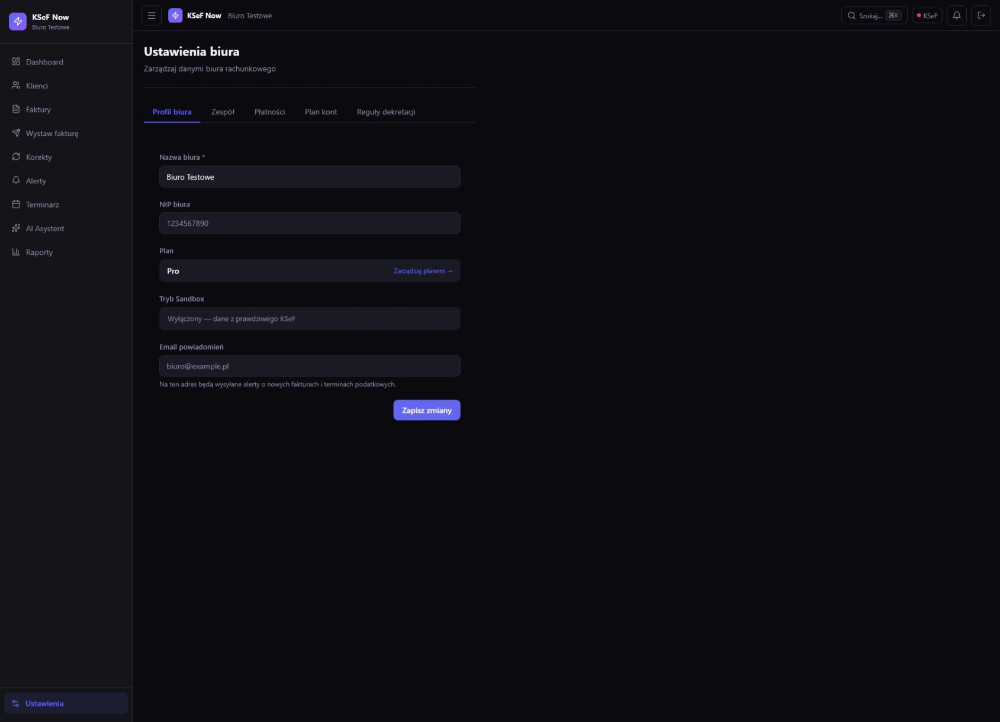

# KSeF Now

> KSeF automation SaaS for Polish accounting firms — AI invoice analysis, Ministry of Finance API sync, Stripe billing.

## What is it

KSeF Now is a SaaS platform for accounting firms and bookkeepers that automates handling of mandatory KSeF (required from 2026). The application uses AI to analyze invoices, detect anomalies, and validate documents before submission to the Ministry of Finance system — with bidirectional sync to the National e-Invoice System API.

## Features

- **AI categorization** — automatic recognition of cost type, VAT rate, and accounting code via Anthropic Claude Sonnet via OpenRouter
- **KSeF Sync** — bidirectional synchronization with the Ministry of Finance API, queues, retries, event log
- **Anomaly alerts** — duplicate detection, unusual amounts, contractors outside the VAT whitelist
- **KSeF Sandbox** — test integration in the MF sandbox environment without production impact
- **Analytics dashboard** — invoice history, submission statuses, monthly charts
- **Multi-client management** — manage multiple accounting clients from a single panel (Supabase RLS)
- **Stripe billing** — SaaS subscriptions with 7-day trial and webhook handling
- **DPA compliance** — data processing agreement template for GDPR compliance
- **Playwright scraping** — automated invoice retrieval from external accounting systems

## Stack

| Layer | Technology |
|-------|-----------|
| Frontend | Next.js, React, TypeScript, Tailwind CSS |
| Backend | Next.js API Routes, Zod validation |
| AI | Anthropic Claude Sonnet via OpenRouter |
| Database | Supabase (PostgreSQL + Auth + RLS) |
| Payments | Stripe (subscriptions, webhooks) |
| Email | Nodemailer |
| Charts | Recharts |
| Animations | Framer Motion |
| Deploy | Vercel |

## Status

Live — [ksefnow.pl](https://ksefnow.pl)

---
Built by [Emil Piński](https://emilpinski.pl)

> Source code is private. [Contact for collaboration](mailto:emilpinskidev@gmail.com)

## Screenshots

